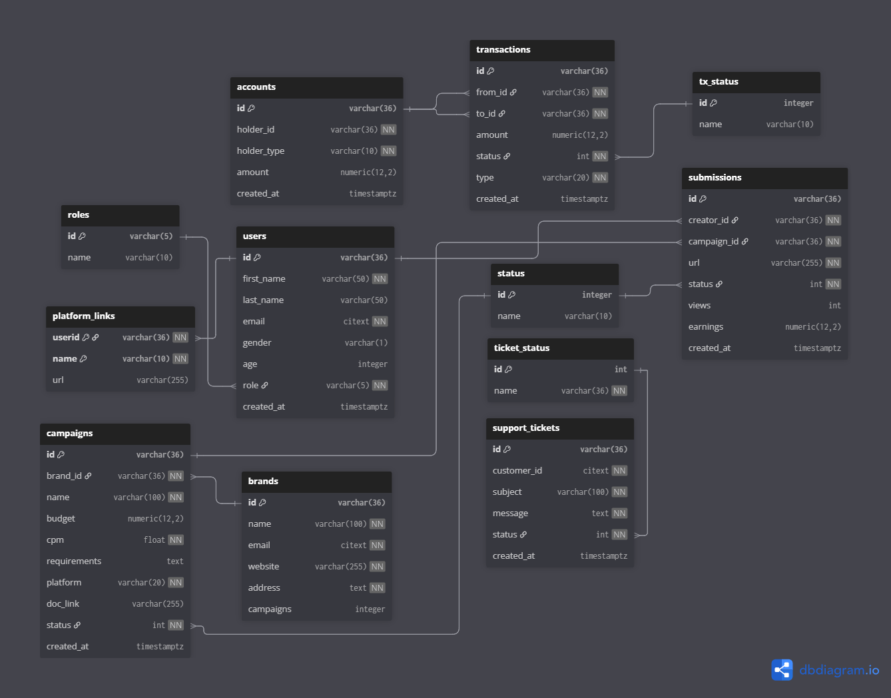

# 🎯 CampaignHub

> **Performance-driven platform connecting Companies and Creators through video-based marketing campaigns.**  
> Companies pay only for real views. Creators earn through verified submissions and real-time analytics.

---

## 📐 ER Diagram

  
*(Exported from [dbdiagram.io](https://dbdiagram.io))*  

---

## 🚀 Features

### 🧑‍💼 Companies
- Create and manage ad campaigns  
- Pay per real view (CPM-based)  
- Track campaign and submission performance  
- Approve/reject creator submissions  
- Manage wallet (add funds, withdraw with admin approval)  
- Chat with creators  

### 👩‍🎤 Creators
- Discover live brand campaigns  
- Submit video URLs and earn from verified views  
- Track earnings in real time  
- Withdraw anytime  
- Chat with brands  

### 🛡️ Admin
- Monitors all transactions and campaigns  
- Approves withdrawals  
- Receives support tickets via email  
- Oversees performance across the platform  

---

## 🧠 Business Logic Overview

| Flow | Description |
|------|--------------|
| **Campaign Lifecycle** | Draft → Active → Creators Submit → Brand Approves → Views Tracked → Payments Auto-deducted → End on Budget Exhaust |
| **Real-time Earnings** | CPM-based auto-crediting for creators and auto-debit from brand wallet |
| **Wallet System** | Dual wallet model (Brand / Creator) with live balance updates |
| **Authentication** | Role-based (Users / Brands / Admin), via JWT and middleware |
| **Support System** | Ticket submission + admin email alerts |
| **Chat System** | Campaign-specific chats unlocked post-submission |

---

## 🗄️ Database Models

### 🧍 Users
| Field | Type | Notes |
|--------|------|-------|
| id | varchar(36) | Primary key |
| first_name / last_name | varchar |  |
| email | citext | unique |
| password | bytea | hashed |
| gender | char(1) | M/F/O |
| age | int |  |
| role | varchar(5) | user / brand / admin |
| is_verified | boolean |  |
| created_at | timestamptz |  |

### 🏢 Brands
| Field | Type | Notes |
|--------|------|-------|
| id | varchar(36) | Primary key |
| name / email / sector / website / address | text |  |
| campaigns | int | number of active campaigns |
| is_verified | boolean |  |

### 🎯 Campaigns
| Field | Type | Notes |
|--------|------|-------|
| id | varchar(36) | Primary key |
| brand_id | varchar(36) | FK → brands |
| title | varchar(100) |  |
| budget | numeric |  |
| cpm | float | cost per 1000 views |
| requirements | text | campaign instructions |
| platform | varchar(20) | youtube / instagram |
| doc_link | varchar(255) | reference file |
| status | int | 1: active, 0: draft |
| created_at | timestamptz |  |

### 🎥 Submissions
| Field | Type | Notes |
|--------|------|-------|
| id | varchar(36) | Primary key |
| creator_id | varchar(36) | FK → users |
| campaign_id | varchar(36) | FK → campaigns |
| url | varchar(255) | submitted video |
| views / like_count / earnings | numeric | tracked metrics |
| status | int | 1: approved, 0: pending |
| created_at | timestamptz |  |

### 💳 Accounts
| Field | Type | Notes |
|--------|------|-------|
| id | varchar(36) | Primary key |
| holder_id | varchar(36) | FK → users/brands |
| holder_type | varchar(10) | "brand" or "creator" |
| amount | numeric | wallet balance |
| active | boolean |  |

### 📨 Support Tickets
| Field | Type | Notes |
|--------|------|-------|
| id | varchar(36) | Primary key |
| customer_id | varchar(36) | FK → users/brands |
| subject / message | text |  |
| status | int | open / closed |
| created_at | timestamptz |  |

---

## 🔌 API Endpoints (from `server.go`)

### 🧭 Auth & Verification
| Method | Route | Handler | Notes |
|--------|--------|----------|-------|
| GET | `/` | `HealthCheck` | API heartbeat |
| GET | `/verify/:entity` | `Verification` | verify users or brands |
| POST | `/login` | `Login` | login route |
| POST | `/users/signup` | `CreateUser` | signup for creators |
| POST | `/brands/signup` | `CreateBrand` | signup for brands |
| POST | `/forgot_password/request/:entity` | `ForgotPassword` | send reset email |
| POST | `/forgot_password/confirm/:entity` | `ResetPassword` | verify reset token |

### 👤 Users
| Method | Route | Handler | Purpose |
|--------|--------|----------|---------|
| GET | `/users/:id` | `GetUserById` | Fetch user info |
| GET | `/users/email/:email` | `GetUserByEmail` | Fetch by email |
| PATCH | `/users/:id` | `UpdateUser` | Update profile |
| DELETE | `/users/:id` | `DeleteUser` | Remove user |
| GET | `/users/campaigns/:id` | `GetUserCampaigns` | List joined campaigns |

### 🏢 Brands
| Method | Route | Handler | Purpose |
|--------|--------|----------|---------|
| GET | `/brands/:brand_id` | `GetBrand` | Fetch brand info |
| PATCH | `/brands/:brand_id` | `UpdateBrand` | Update details |
| DELETE | `/brands/:brand_id` | `DeleteBrand` | Remove brand |
| GET | `/brands/campaigns/:brand_id` | `GetBrandCampaigns` | Get campaigns by brand |

### 🎯 Campaigns
| Method | Route | Handler | Purpose |
|--------|--------|----------|---------|
| GET | `/campaigns` | `GetCampaignFeed` | Paginated campaign feed |
| GET | `/campaigns/:campaign_id` | `GetCampaign` | Get campaign by ID |
| POST | `/campaigns` | `CreateCampaign` | New campaign |
| PATCH | `/campaigns/:campaign_id` | `UpdateCampaign` | Edit campaign |
| PUT | `/campaigns/:campaign_id` | `StopCampaign` | Stop campaign |
| DELETE | `/campaigns/:campaign_id` | `DeleteCampaign` | Remove campaign |

### 📝 Applications
| Method | Route | Handler | Purpose |
|--------|--------|----------|---------|
| GET | `/applications/:application_id` | `GetApplication` | Fetch single application |
| GET | `/applications/campaigns/:campaign_id` | `GetCampaignApplications` | Campaign’s applicants |
| GET | `/applications/my-applications` | `GetCreatorApplications` | Creator’s submissions |
| POST | `/applications` | `CreateApplication` | Apply to campaign |
| PATCH | `/applications/status/:application_id` | `SetApplicationStatus` | Update status |
| DELETE | `/applications/delete/:application_id` | `DeleteApplication` | Remove application |

### 🎫 Tickets
| Method | Route | Handler | Purpose |
|--------|--------|----------|---------|
| GET | `/tickets` | `GetRecentTickets` | Filter by status |
| GET | `/tickets/:ticket_id` | `GetTicket` | Fetch ticket details |
| POST | `/tickets` | `RaiseTicket` | Submit issue |
| PUT | `/tickets/:ticket_id` | `CloseTicket` | Close ticket |
| DELETE | `/tickets/:ticket_id` | `DeleteTicket` | Remove ticket |

### 📦 Submissions
| Method | Route | Handler | Purpose |
|--------|--------|----------|---------|
| GET | `/submissions` | `FilterSubmissions` | Filter by creator/campaign/time |
| GET | `/submissions/my-submissions` | `GetMySubmissions` | Fetch creator’s submissions |
| POST | `/submissions` | `CreateSubmission` | Submit video |
| PATCH | `/submissions/:sub_id` | `UpdateSubmission` | Edit submission |
| DELETE | `/submissions/:sub_id` | `DeleteSubmission` | Remove submission |

### 💰 Accounts
| Method | Route | Handler | Purpose |
|--------|--------|----------|---------|
| GET | `/accounts` | `GetAllAccounts` | List all |
| GET | `/accounts/:acc_id` | `GetUserAccount` | Get user account |
| POST | `/accounts` | `CreateAccount` | Create wallet |
| PUT | `/accounts/accounts/:acc_id` | `DisableUserAccount` | Disable account |
| DELETE | `/accounts/accounts/:acc_id` | `DeleteUserAccount` | Delete wallet |

---

## 🧱 Tech Stack

- **Backend:** Go (Gin Framework)
- **Database:** PostgreSQL  
- **Auth:** JWT + Middleware  
- **Cache:** Redis (planned for real-time updates)  
- **Email:** SMTP (password reset, admin notifications)  
- **Hosting:** Docker + Cloud Deployment (planned)

---

## ⚙️ Setup Instructions

```bash
# clone repository
git clone https://github.com/Alter-Sitanshu/campaignHub.git
cd campaignHub

# configure environment
cp .env.example .env
# fill DB_URL, JWT_SECRET, SMTP credentials

# run server
go run main.go